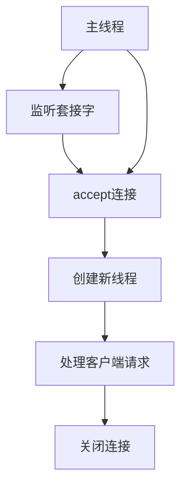
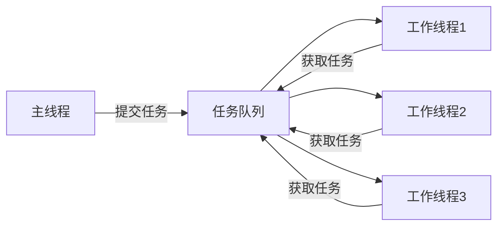

## 通俗导读

网络编程可以先理解成“两个程序通过操作系统收发字节”。Socket 就是操作系统给程序开的网络门口。

```text
服务器监听端口 -> 客户端连接 -> 双方 send/recv -> 关闭连接
```

## 先看例子

```cpp
int fd = socket(AF_INET, SOCK_STREAM, 0);
connect(fd, (sockaddr*)&server_addr, sizeof(server_addr));
send(fd, "hello", 5, 0);
```

这段代码做了三件事：创建 TCP socket，连接服务器，发送一段数据。服务端对应地会 `bind`、`listen`、`accept`、`recv`。

## 阅读建议

先掌握 IP、端口、TCP/UDP，再看 socket 函数。不要只背 API 名字，要把客户端和服务端的调用顺序画出来。

## 完整笔记

下面保留原文档的完整内容，并在前面补了通俗导读。原有知识点、表格和代码例子都不删减。

# 基于套接字（Socket）通信

## 一、Socket 通信基础

**套接字（Socket）** 是网络通信的端点，是操作系统提供的一种抽象接口，用于实现不同主机/进程间的网络数据传输。C++ 网络编程基于 **Berkeley Socket API**（跨平台，Windows 下为 Winsock，Linux/macOS 下为 BSD Socket），核心是通过 Socket 接口操作网络协议栈（TCP/IP）。

## 二、网络基础概念

### 1. 局域网（LAN）与广域网（WAN）

|**类型**|**范围**|**特点**|**典型设备**|
|:--|:--|:--|:--|
|**局域网（LAN）**|小范围（家庭、办公室，几米到几公里）|高带宽、低延迟、私有 IP 地址（如 192.168.x.x）、广播域小（用交换机连接）|交换机、路由器、无线 AP|
|**广域网（WAN）**|大范围（城市、国家，跨地域）|低带宽、高延迟、公有 IP 地址（由 ISP 分配）、通过路由器连接多个 LAN（如互联网）|路由器、调制解调器、卫星链路|

### 2. IP 地址

**IP 地址** 是网络中主机的唯一标识，用于定位网络中的设备。

- **IPv4**：32 位二进制数，点分十进制表示（如 `192.168.1.1`），分为网络号和主机号（子网掩码划分）。
    
- **IPv6**：128 位二进制数，冒分十六进制表示（如 `2001:0db8:85a3::8a2e:0370:7334`），解决 IPv4 地址耗尽问题。
    
- **特殊 IP**：
    
    - `127.0.0.1`（本地回环地址）：测试本机网络协议栈。
        
    - `0.0.0.0`：绑定所有网卡（服务器监听所有 IP）。
        

### 3. 端口（Port）

**端口** 是主机上进程的标识（16 位无符号整数，范围 0~65535），用于区分同一主机上的不同网络应用。

|**端口范围**|**用途**|**示例**|
|:--|:--|:--|
|0~1023（知名端口）|分配给系统/标准服务（需 root 权限）|HTTP（80）、HTTPS（443）|
|1024~49151（注册端口）|用户程序注册使用|MySQL（3306）、Redis（6379）|
|49152~65535（动态端口）|临时分配给客户端（系统自动分配）|客户端连接服务器的临时端口|

## 三、网络协议与 Socket 通信

网络数据传输基于 **TCP/IP 协议栈**，Socket 通信主要涉及 **传输层（TCP/UDP）** 和 **网络层（IP）**。

### 1. 核心协议

- **IP 协议**（网络层）：负责数据包的路由和寻址（源/目的 IP）。
    
- **TCP 协议**（传输层）：面向连接、可靠的字节流传输（三次握手建立连接，四次挥手断开连接）。
    
- **UDP 协议**（传输层）：无连接、不可靠的数据报传输（速度快，适合实时性要求高的场景，如视频通话）。
    

### 2. Socket 类型

C++ 中通过 `socket()` 函数创建 Socket，需指定 **地址族**、**套接字类型**、**协议**：

|**参数**|**取值**|**说明**|
|:--|:--|:--|
|地址族（domain）|`AF_INET`（IPv4）、`AF_INET6`（IPv6）|网络层协议族|
|套接字类型（type）|`SOCK_STREAM`（TCP）、`SOCK_DGRAM`（UDP）|传输层协议类型（字节流/数据报）|
|协议（protocol）|`IPPROTO_TCP`（TCP）、`IPPROTO_UDP`（UDP）|通常为 0（自动匹配类型对应的协议）|

## 四、字节序与大小端转换

### 1. 字节序问题

- **大端字节序（Big-Endian）**：高位字节存放在低地址（网络字节序标准，如 TCP/IP 协议）。
    
- **小端字节序（Little-Endian）**：低位字节存放在低地址（x86/x64 CPU 默认）。
    

**问题**：主机字节序（可能小端）与网络字节序（大端）不一致，需转换后才能正确解析数据（如端口号、IP 地址）。

### 2. 大小端转换函数（C++ 标准库）

|**函数**|**原型**|**功能**|**示例**|
|:--|:--|:--|:--|
|`htons`|`uint16_t htons(uint16_t hostshort)`|主机字节序（16位）→ 网络字节序（大端）|`uint16_t port = htons(8080);`（端口 8080 转网络字节序）|
|`htonl`|`uint32_t htonl(uint32_t hostlong)`|主机字节序（32位）→ 网络字节序（大端）|`uint32_t ip = inet_addr("192.168.1.1");`（IP 转网络字节序）|
|`ntohs`|`uint16_t ntohs(uint16_t netshort)`|网络字节序（16位）→ 主机字节序|`uint16_t port = ntohs(net_port);`（解析端口）|
|`ntohl`|`uint32_t ntohl(uint32_t netlong)`|网络字节序（32位）→ 主机字节序|`uint32_t ip = ntohl(net_ip);`（解析 IP）|

## 五、TCP 通信特点

TCP（Transmission Control Protocol）是 **面向连接的、可靠的、基于字节流的传输层协议**，核心特点：

1. **面向连接**：通信前需通过“三次握手”建立连接，结束后通过“四次挥手”断开连接。
    
2. **可靠传输**：通过 **确认应答（ACK）**、**超时重传**、**流量控制（滑动窗口）**、**拥塞控制** 保证数据不丢失、不重复、按序到达。
    
3. **字节流**：数据无边界（如发送 "ABC" 和 "DEF"，接收方可能一次性收 "ABCDEF"）。
    
4. **全双工通信**：双方可同时发送/接收数据。
    

## 六、TCP 通信流程（C++ 实现）

TCP 通信需区分 **服务器端** 和 **客户端**，流程如下：

### 1. 服务器端流程

```cpp
// 1. 创建 Socket（TCP 套接字）
int server_fd = socket(AF_INET, SOCK_STREAM, 0);  // AF_INET: IPv4, SOCK_STREAM: TCP
if (server_fd == -1) { /* 错误处理 */ }

// 2. 绑定 IP 和端口（bind）
struct sockaddr_in addr;
memset(&addr, 0, sizeof(addr));
addr.sin_family = AF_INET;          // IPv4
addr.sin_port = htons(8080);         // 端口（网络字节序）
addr.sin_addr.s_addr = INADDR_ANY;   // 绑定所有网卡（0.0.0.0）
if (bind(server_fd, (struct sockaddr*)&addr, sizeof(addr)) == -1) { /* 错误处理 */ }

// 3. 监听连接（listen）
if (listen(server_fd, 5) == -1) { /* 错误处理 */ }  //  backlog=5（最大等待连接数）

// 4. 接受客户端连接（accept，阻塞等待）
struct sockaddr_in client_addr;
socklen_t client_len = sizeof(client_addr);
int client_fd = accept(server_fd, (struct sockaddr*)&client_addr, &client_len);  // 返回客户端 Socket
if (client_fd == -1) { /* 错误处理 */ }

// 5. 收发数据（recv/send）
char buf[1024];
ssize_t n = recv(client_fd, buf, sizeof(buf)-1, 0);  // 接收数据（阻塞）
if (n > 0) {
  buf[n] = '\0';  // 字符串结束符
  send(client_fd, "OK", 2, 0);  // 发送响应
}

// 6. 关闭连接（close）
close(client_fd);   // 关闭客户端 Socket
close(server_fd);   // 关闭服务器 Socket（通常在程序退出时）
```

### 2. 客户端流程

```cpp
// 1. 创建 Socket（TCP 套接字）
int sock_fd = socket(AF_INET, SOCK_STREAM, 0);
if (sock_fd == -1) { /* 错误处理 */ }

// 2. 连接服务器（connect）
struct sockaddr_in server_addr;
memset(&server_addr, 0, sizeof(server_addr));
server_addr.sin_family = AF_INET;
server_addr.sin_port = htons(8080);  // 服务器端口（网络字节序）
// 服务器 IP（字符串转网络字节序）
inet_pton(AF_INET, "127.0.0.1", &server_addr.sin_addr);  // IPv4 专用函数（推荐）
// 或用旧函数：server_addr.sin_addr.s_addr = inet_addr("127.0.0.1");
if (connect(sock_fd, (struct sockaddr*)&server_addr, sizeof(server_addr)) == -1) { /* 错误处理 */ }

// 3. 收发数据（send/recv）
send(sock_fd, "Hello Server", 13, 0);  // 发送数据
char buf[1024];
ssize_t n = recv(sock_fd, buf, sizeof(buf)-1, 0);  // 接收响应
if (n > 0) { buf[n] = '\0'; printf("Server: %s\n", buf); }

// 4. 关闭连接（close）
close(sock_fd);
```

### 3. 关键函数说明

|**函数**|**作用**|**参数说明**|
|:--|:--|:--|
|`socket()`|创建 Socket|`domain`（地址族）、`type`（套接字类型）、`protocol`（协议，0 自动匹配）|
|`bind()`|绑定 IP 和端口到 Socket|`sockfd`（Socket 描述符）、`addr`（地址结构体）、`addrlen`（地址长度）|
|`listen()`|监听连接（仅服务器）|`sockfd`（服务器 Socket）、`backlog`（最大等待连接数，通常 5~10）|
|`accept()`|接受客户端连接（仅服务器，阻塞）|`sockfd`（服务器 Socket）、`addr`（客户端地址）、`addrlen`（地址长度指针）|
|`connect()`|连接服务器（仅客户端）|`sockfd`（客户端 Socket）、`addr`（服务器地址）、`addrlen`（地址长度）|
|`send()`/`recv()`|发送/接收数据（TCP 字节流）|`sockfd`（Socket 描述符）、`buf`（数据缓冲区）、`len`（长度）、`flags`（0 默认）|
|`close()`|关闭 Socket（释放资源）|`sockfd`（Socket 描述符）|

## 七、注意事项

1. **错误处理**：所有 Socket 函数返回 -1 表示失败，需通过 `errno`（Linux）或 `WSAGetLastError()`（Windows）获取错误码。
    
2. **IP 地址转换**：
    
    - 字符串转网络字节序：`inet_pton(AF_INET, "192.168.1.1", &addr.sin_addr)`（推荐，支持 IPv6）。
        
    - 网络字节序转字符串：`inet_ntop(AF_INET, &addr.sin_addr, buf, sizeof(buf))`。
        
3. **跨平台兼容**：Windows 需初始化 Winsock（`WSAStartup()`），Linux/macOS 直接用 Berkeley Socket API。
    
4. **阻塞与非阻塞**：默认 Socket 为阻塞模式（`recv`/`accept` 会阻塞），可通过 `fcntl()`（Linux）或 `ioctlsocket()`（Windows）设置为非阻塞。
    

# Socket 核心函数与 Windows 平台适配

## 一、核心 Socket 函数详解

以下函数基于 **Berkeley Socket API**（Linux/macOS），Windows 平台需通过 **Winsock** 适配（见后文“Windows 平台差异”）。

### 1. `socket()`：创建套接字

**作用**：创建一个通信端点（套接字），返回套接字描述符（Linux）或句柄（Windows），用于后续操作。

#### 函数原型

```c
// Linux/macOS (Berkeley Socket)
#include <sys/socket.h>
int socket(int domain, int type, int protocol);

// Windows (Winsock2)
#include <winsock2.h>
SOCKET socket(int af, int type, int protocol);  // SOCKET 是无符号整型（typedef UINT_PTR SOCKET）
```

#### 参数说明

|**参数**|**取值**|**说明**|
|:--|:--|:--|
|`domain`|`AF_INET`（IPv4）、`AF_INET6`（IPv6）、`AF_UNIX`（本地进程间通信）|地址族（Address Family），指定网络层协议|
|`type`|`SOCK_STREAM`（TCP，字节流）、`SOCK_DGRAM`（UDP，数据报）、`SOCK_RAW`（原始套接字）|套接字类型（传输层协议特性）|
|`protocol`|`IPPROTO_TCP`（TCP）、`IPPROTO_UDP`（UDP）、`0`（自动匹配 type 对应的协议）|协议号（0 表示默认协议）|

#### 返回值

- **成功**：返回套接字描述符（Linux，`int` 类型，非负整数）或句柄（Windows，`SOCKET` 类型，非 `INVALID_SOCKET`）。
    
- **失败**：返回 `-1`（Linux）或 `INVALID_SOCKET`（Windows，定义为 `(SOCKET)(~0)`）。
    

#### 示例（Linux）

```cpp
int server_fd = socket(AF_INET, SOCK_STREAM, 0);  // 创建 IPv4 TCP 套接字
if (server_fd == -1) {
  perror("socket failed");  // 打印错误原因（依赖 errno）
  exit(EXIT_FAILURE);
}
```

### 2. `bind()`：绑定 IP 地址和端口

**作用**：将套接字与本地 IP 地址和端口号绑定（服务器端必需，客户端可选）。

#### 函数原型

```c
// Linux/macOS
#include <sys/socket.h>
int bind(int sockfd, const struct sockaddr *addr, socklen_t addrlen);

// Windows
int bind(SOCKET s, const struct sockaddr *addr, int addrlen);  // addrlen 为 int 类型
```

#### 参数说明

|**参数**|**说明**|
|:--|:--|
|`sockfd`|`socket()` 返回的套接字描述符/句柄|
|`addr`|指向 `sockaddr` 结构体的指针（需转换为具体协议的结构体，如 IPv4 用 `sockaddr_in`）|
|`addrlen`|`addr` 结构体的长度（字节）|

#### `sockaddr_in` 结构体（IPv4）

```cpp
struct sockaddr_in {
  sa_family_t    sin_family;  // 地址族（AF_INET）
  in_port_t      sin_port;    // 端口号（网络字节序，需用 htons 转换）
  struct in_addr sin_addr;    // IP 地址（网络字节序，需用 inet_pton 转换）
  char           sin_zero[8]; // 填充字段（未使用，置 0）
};

struct in_addr {
  uint32_t s_addr;  // 32 位 IPv4 地址（网络字节序）
};
```

#### 关键注意事项

- **端口转换**：端口号需用 `htons()` 从主机字节序转为网络字节序（大端）。
    
- **IP 地址**：
    
    - 服务器常用 `INADDR_ANY`（值为 0，绑定所有网卡，即 `0.0.0.0`）。
        
    - 指定 IP 时用 `inet_pton(AF_INET, "192.168.1.1", &addr.sin_addr)`（推荐，支持 IPv6）。
        
- **端口复用**：若需重启服务器时立即重用端口，需设置 `SO_REUSEADDR` 选项：
    
    ```cpp
    int opt = 1;
    setsockopt(server_fd, SOL_SOCKET, SO_REUSEADDR, &opt, sizeof(opt));  // 允许端口复用
    ```
    

#### 示例（Linux 服务器绑定端口 8080）

```cpp
struct sockaddr_in addr;
memset(&addr, 0, sizeof(addr));
addr.sin_family = AF_INET;
addr.sin_port = htons(8080);          // 端口 8080（网络字节序）
addr.sin_addr.s_addr = INADDR_ANY;     // 绑定所有网卡

if (bind(server_fd, (struct sockaddr*)&addr, sizeof(addr)) == -1) {
  perror("bind failed");
  close(server_fd);
  exit(EXIT_FAILURE);
}
```

### 3. `listen()`：监听连接（仅服务器）

**作用**：将主动套接字（默认）转为被动套接字，开始监听客户端的连接请求。

#### 函数原型

```c
// Linux/macOS
int listen(int sockfd, int backlog);

// Windows
int listen(SOCKET s, int backlog);
```

#### 参数说明

|**参数**|**说明**|
|:--|:--|
|`sockfd`|已绑定的服务器套接字描述符/句柄|
|`backlog`|未完成连接队列（SYN 队列）的最大长度（半连接数），已完成连接队列（ACCEPT 队列）由系统自动管理。  <br>建议值：5~10（过小会拒绝连接，过大浪费资源）|

#### 返回值

- 成功：0；失败：-1（Linux）或 `SOCKET_ERROR`（Windows）。
    

#### 示例

```cpp
if (listen(server_fd, 5) == -1) {  // 最大 5 个半连接
  perror("listen failed");
  close(server_fd);
  exit(EXIT_FAILURE);
}
```

### 4. `accept()`：接受客户端连接（仅服务器）

**作用**：从已完成连接队列中取出一个客户端连接，返回**新的套接字**（用于与该客户端通信），原服务器套接字继续监听。

#### 函数原型

```c
// Linux/macOS
int accept(int sockfd, struct sockaddr *addr, socklen_t *addrlen);

// Windows
SOCKET accept(SOCKET s, struct sockaddr *addr, int *addrlen);
```

#### 参数说明

|**参数**|**说明**|
|:--|:--|
|`sockfd`|处于监听状态的服务器套接字描述符/句柄|
|`addr`|输出参数，指向 `sockaddr` 结构体的指针，用于存储**客户端地址信息**（可为 `NULL`，表示不关心）|
|`addrlen`|输入输出参数：输入时指定 `addr` 的长度，输出时返回实际存储的地址长度（字节）|

#### 返回值

- **成功**：返回**新的客户端套接字描述符/句柄**（用于后续 `send/recv`）。
    
- **失败**：返回 `-1`（Linux）或 `INVALID_SOCKET`（Windows）。
    

#### 关键特性

- **阻塞模式**：默认阻塞，直到有客户端连接才返回（可通过 `fcntl` 或 `ioctlsocket` 设为非阻塞）。
    
- **新套接字**：每个客户端连接对应一个独立的套接字，服务器通过它与客户端一对一通信。
    

#### 示例（Linux 接受客户端连接）

```cpp
struct sockaddr_in client_addr;
socklen_t client_len = sizeof(client_addr);
int client_fd = accept(server_fd, (struct sockaddr*)&client_addr, &client_len);
if (client_fd == -1) {
  perror("accept failed");
  continue;  // 继续监听下一个连接
}

// 打印客户端 IP 和端口（需转换字节序）
char client_ip[INET_ADDRSTRLEN];
inet_ntop(AF_INET, &client_addr.sin_addr, client_ip, sizeof(client_ip));
int client_port = ntohs(client_addr.sin_port);
printf("Client connected: %s:%d\n", client_ip, client_port);
```

### 5. `connect()`：连接服务器（仅客户端）

**作用**：客户端向服务器发起连接请求（TCP 三次握手由此触发）。

#### 函数原型

```c
// Linux/macOS
int connect(int sockfd, const struct sockaddr *addr, socklen_t addrlen);

// Windows
int connect(SOCKET s, const struct sockaddr *name, int namelen);
```

#### 参数说明

|**参数**|**说明**|
|:--|:--|
|`sockfd`|客户端套接字描述符/句柄（已通过 `socket()` 创建）|
|`addr`|指向服务器地址结构体的指针（如 `sockaddr_in`，需填服务器 IP 和端口）|
|`addrlen`|地址结构体的长度（字节）|

#### 返回值

- 成功：0（连接建立）；失败：-1（Linux）或 `SOCKET_ERROR`（Windows）。
    

#### 关键特性

- **阻塞模式**：默认阻塞，直到连接成功或失败（超时由 `SO_SNDTIMEO` 选项控制）。
    
- **非阻塞模式**：若套接字设为非阻塞，`connect()` 会立即返回 `-1`，需通过 `select/poll` 检查连接是否完成。
    

#### 示例（Linux 客户端连接服务器）

```cpp
struct sockaddr_in server_addr;
memset(&server_addr, 0, sizeof(server_addr));
server_addr.sin_family = AF_INET;
server_addr.sin_port = htons(8080);  // 服务器端口（网络字节序）
inet_pton(AF_INET, "127.0.0.1", &server_addr.sin_addr);  // 服务器 IP（本地回环）

if (connect(sock_fd, (struct sockaddr*)&server_addr, sizeof(server_addr)) == -1) {
  perror("connect failed");
  close(sock_fd);
  exit(EXIT_FAILURE);
}
printf("Connected to server!\n");
```

## 二、客户端与服务端通信函数

TCP 通信通过 `send/recv` 收发数据，UDP 通过 `sendto/recvfrom`。

### 1. `send()`：发送数据（TCP）

**作用**：通过 TCP 套接字发送数据（字节流，无消息边界）。

#### 函数原型

```c
// Linux/macOS
ssize_t send(int sockfd, const void *buf, size_t len, int flags);

// Windows
int send(SOCKET s, const char *buf, int len, int flags);
```

#### 参数说明

|**参数**|**说明**|
|:--|:--|
|`sockfd`|已连接的套接字描述符/句柄（客户端用 `client_fd`，服务器用 `accept` 返回的新套接字）|
|`buf`|待发送数据缓冲区指针|
|`len`|发送数据长度（字节）|
|`flags`|发送标志（通常设为 0，可选 `MSG_OOB` 紧急数据、`MSG_DONTROUTE` 绕过路由表）|

#### 返回值

- **成功**：返回实际发送的字节数（可能小于 `len`，需循环发送剩余数据）。
    
- **失败**：返回 `-1`（Linux）或 `SOCKET_ERROR`（Windows）。
    
- **特殊情况**：返回 0 表示连接已关闭（对端调用 `close`）。
    

#### 示例（发送字符串）

```cpp
const char* msg = "Hello Server";
ssize_t n = send(client_fd, msg, strlen(msg), 0);  // 发送数据
if (n == -1) {
  perror("send failed");
} else {
  printf("Sent %zd bytes\n", n);
}
```

### 2. `recv()`：接收数据（TCP）

**作用**：通过 TCP 套接字接收数据（字节流，需自行处理消息边界）。

#### 函数原型

```c
// Linux/macOS
ssize_t recv(int sockfd, void *buf, size_t len, int flags);

// Windows
int recv(SOCKET s, char *buf, int len, int flags);
```

#### 参数说明

|**参数**|**说明**|
|:--|:--|
|`sockfd`|已连接的套接字描述符/句柄|
|`buf`|接收数据缓冲区指针|
|`len`|缓冲区最大长度（字节）|
|`flags`|接收标志（通常设为 0，可选 `MSG_PEEK` 窥探数据（不移除缓冲区）、`MSG_WAITALL` 等待填满缓冲区）|

#### 返回值

- **成功**：返回实际接收的字节数（可能为 0，表示对端关闭连接）。
    
- **失败**：返回 `-1`（Linux）或 `SOCKET_ERROR`（Windows）。
    

#### 示例（接收数据并打印）

```cpp
char buf[1024];
ssize_t n = recv(client_fd, buf, sizeof(buf)-1, 0);  // 留 1 字节给 '\0'
if (n > 0) {
  buf[n] = '\0';  // 字符串结束符
  printf("Received: %s\n", buf);
} else if (n == 0) {
  printf("Client disconnected\n");
  close(client_fd);
} else {
  perror("recv failed");
}
```

### 3. UDP 通信函数（`sendto`/`recvfrom`）

UDP 无连接，通过 `sendto` 发送时需指定目标地址，`recvfrom` 接收时可获取发送方地址。

#### `sendto()` 原型

```c
ssize_t sendto(int sockfd, const void *buf, size_t len, int flags, const struct sockaddr *dest_addr, socklen_t addrlen);
```

#### `recvfrom()` 原型

```c
ssize_t recvfrom(int sockfd, void *buf, size_t len, int flags, struct sockaddr *src_addr, socklen_t *addrlen);
```

## 三、Windows 平台套接字通信函数差异

Windows 不使用 Berkeley Socket API，而是通过 **Winsock 2**（Windows Sockets API），需额外初始化和清理。

### 1. Winsock 初始化与清理

#### `WSAStartup()`：初始化 Winsock

**作用**：加载 Winsock 动态库（如 ws2_32.dll），初始化底层网络协议栈。

##### 函数原型

```cpp
#include <winsock2.h>
int WSAStartup(WORD wVersionRequested, LPWSADATA lpWSAData);
```

##### 参数说明

- `wVersionRequested`：请求的 Winsock 版本（低字节为主版本，高字节为次版本，如 `MAKEWORD(2, 2)` 表示 2.2 版本）。
    
- `lpWSAData`：输出参数，指向 `WSADATA` 结构体，存储初始化信息。
    

##### 返回值

- 成功：0；失败：非 0（需用 `WSAGetLastError()` 获取错误码）。
    

##### 示例

```cpp
#include <winsock2.h>
#pragma comment(lib, "ws2_32.lib")  // 链接 ws2_32 库（MSVC）

WSADATA wsaData;
if (WSAStartup(MAKEWORD(2, 2), &wsaData) != 0) {
  printf("WSAStartup failed: %d\n", WSAGetLastError());
  return 1;
}
```

#### `WSACleanup()`：清理 Winsock

**作用**：释放 Winsock 资源，需在程序退出前调用。

##### 函数原型

```cpp
int WSACleanup(void);  // 成功返回 0，失败返回 SOCKET_ERROR
```

### 2. Windows 套接字核心函数差异

|**功能**|**Berkeley Socket（Linux）**|**Winsock 2（Windows）**|
|:--|:--|:--|
|套接字类型|`int`（描述符）|`SOCKET`（无符号整型，`INVALID_SOCKET` 表示无效）|
|关闭套接字|`close(int fd)`|`closesocket(SOCKET s)`|
|错误处理|`errno`（全局变量）+ `perror()`|`WSAGetLastError()`（返回错误码）|
|函数前缀|无（如 `socket`、`bind`）|部分函数带 `WSAPrefix`（如 `WSASocket`，但通常直接用无前缀版本兼容 Berkeley API）|

### 3. Windows 平台 TCP 通信示例（客户端）

```cpp
#include <iostream>
#include <winsock2.h>
#pragma comment(lib, "ws2_32.lib")

int main() {
  // 1. 初始化 Winsock
  WSADATA wsaData;
  if (WSAStartup(MAKEWORD(2, 2), &wsaData) != 0) {
    std::cerr << "WSAStartup failed: " << WSAGetLastError() << std::endl;
    return 1;
  }

  // 2. 创建套接字
  SOCKET sock_fd = socket(AF_INET, SOCK_STREAM, 0);
  if (sock_fd == INVALID_SOCKET) {
    std::cerr << "socket failed: " << WSAGetLastError() << std::endl;
    WSACleanup();
    return 1;
  }

  // 3. 连接服务器
  sockaddr_in server_addr{};
  server_addr.sin_family = AF_INET;
  server_addr.sin_port = htons(8080);
  inet_pton(AF_INET, "127.0.0.1", &server_addr.sin_addr);

  if (connect(sock_fd, (sockaddr*)&server_addr, sizeof(server_addr)) == SOCKET_ERROR) {
    std::cerr << "connect failed: " << WSAGetLastError() << std::endl;
    closesocket(sock_fd);
    WSACleanup();
    return 1;
  }

  // 4. 发送/接收数据
  const char* msg = "Hello from Windows Client";
  send(sock_fd, msg, strlen(msg), 0);

  char buf[1024];
  int n = recv(sock_fd, buf, sizeof(buf)-1, 0);
  if (n > 0) {
    buf[n] = '\0';
    std::cout << "Server response: " << buf << std::endl;
  }

  // 5. 清理
  closesocket(sock_fd);
  WSACleanup();
  return 0;
}
```

## 四、关键注意事项

1. **字节序转换**：所有网络数据（端口、IP）需用 `htons`/`htonl`（主机→网络）和 `ntohs`/`ntohl`（网络→主机）转换。
    
2. **错误处理**：每次调用套接字函数后检查返回值，通过 `perror`（Linux）或 `WSAGetLastError`（Windows）定位错误。
    
3. **跨平台兼容**：
    
    - Linux 需包含头文件 `<sys/socket.h>`、`<netinet/in.h>`、`<arpa/inet.h>`。
        
    - Windows 需包含 `<winsock2.h>`，链接 `ws2_32.lib`，并优先调用 `WSAStartup`。
        
4. **非阻塞模式**：通过 `fcntl(sockfd, F_SETFL, O_NONBLOCK)`（Linux）或 `ioctlsocket(sock_fd, FIONBIO, &mode)`（Windows）设置，配合 `select/poll/epoll` 实现异步 I/O。
    

## 五、总结

Socket 通信的核心是 **“创建-绑定-监听-连接-通信-关闭”** 流程，其中 `socket/bind/listen/accept/connect` 是控制连接的关键函数，`send/recv` 是数据传输的核心。Windows 平台需通过 Winsock 初始化，函数与 Linux 高度相似但需注意句柄类型、错误处理和库的链接。掌握这些函数细节，可实现跨平台的客户端/服务器通信（如聊天程序、文件传输工具）。


# 服务端/客户端实现详解

## 一、核心概念解析

### 1. 文件描述符（File Descriptor）

- **本质**：操作系统内核为每个进程维护的**打开文件表**的索引
    
- **类型**：
    
    - 普通文件描述符（磁盘文件）
        
    - 套接字描述符（网络通信）
        
    - 管道描述符（进程间通信）
        
- **特点**：
    
    - 非负整数（0=标准输入，1=标准输出，2=标准错误）
        
    - 进程级唯一标识
        
    - 通过`read()`/`write()`进行I/O操作
        
- **套接字与文件描述符关系**：
    
    ```mermaid
    graph LR
    A[应用程序] --> B[套接字描述符]
    B --> C[内核协议栈]
    C --> D[网络接口]
    ```
    

### 2. 套接字通信模型

|**模型**|**特点**|**适用场景**|
|:--|:--|:--|
|流式套接字(SOCK_STREAM)|可靠、面向连接、字节流(TCP)|文件传输、网页浏览|
|数据报套接字(SOCK_DGRAM)|不可靠、无连接、数据报(UDP)|视频流、DNS查询|
|原始套接字(SOCK_RAW)|直接访问底层协议|网络诊断、安全应用|

## 二、TCP通信实现（Linux平台）

### 1. 服务端实现（回声服务器）

```cpp
#include <sys/socket.h>
#include <netinet/in.h>
#include <unistd.h>
#include <cstring>
#include <iostream>
#include <arpa/inet.h>

#define PORT 8080
#define BUFFER_SIZE 1024

int main() {
    int server_fd, new_socket;
    struct sockaddr_in address;
    int opt = 1;
    int addrlen = sizeof(address);
    char buffer[BUFFER_SIZE] = {0};

    // 1. 创建套接字
    if ((server_fd = socket(AF_INET, SOCK_STREAM, 0)) == 0) {
        perror("socket failed");
        exit(EXIT_FAILURE);
    }
    
    // 2. 设置套接字选项（端口复用）
    if (setsockopt(server_fd, SOL_SOCKET, SO_REUSEADDR | 
    SO_REUSEPORT, &opt, sizeof(opt))) {
        perror("setsockopt failed");
        exit(EXIT_FAILURE);
    }
    
    // 3. 绑定地址
    address.sin_family = AF_INET;
    address.sin_addr.s_addr = INADDR_ANY;
    address.sin_port = htons(PORT);
    
    if (bind(server_fd, (struct sockaddr *)&address, 
    sizeof(address)) < 0) {
        perror("bind failed");
        exit(EXIT_FAILURE);
    }
    
    // 4. 监听连接
    if (listen(server_fd, 3) < 0) {
        perror("listen failed");
        exit(EXIT_FAILURE);
    }
    
    cout << "Server listening on port " << PORT << endl;
    
    // 5. 接受客户端连接
    if ((new_socket = accept(server_fd, 
    (struct sockaddr*)&address, 
    (socklen_t*)&addrlen)) < 0) 
    {
        perror("accept failed");
        exit(EXIT_FAILURE);
    }
    
    // 打印客户端信息
    char client_ip[INET_ADDRSTRLEN];
    inet_ntop(AF_INET, &address.sin_addr, client_ip,
     INET_ADDRSTRLEN);
    std::cout << "Client connected: " << client_ip 
              << ":" << ntohs(address.sin_port) << std::endl;
    
    // 6. 通信循环
    while (true) {
        // 接收数据
        ssize_t valread = read(new_socket, buffer, 
        BUFFER_SIZE);
        if (valread <= 0) {
            if (valread == 0) {
                std::cout << "Client disconnected" << 
                std::endl;
            } else {
                perror("read error");
            }
            break;
        }
        
        buffer[valread] = '\0';
        std::cout << "Received: " << buffer << std::endl;
        
        // 发送响应（回声）
        if (send(new_socket, buffer, valread, 0) != valread) {
            perror("send failed");
            break;
        }
    }
    
    // 7. 关闭套接字
    close(new_socket);
    close(server_fd);
    return 0;
}
```

### 2. 客户端实现

```cpp
#include <sys/socket.h>
#include <netinet/in.h>
#include <arpa/inet.h>
#include <unistd.h>
#include <cstring>
#include <iostream>
#include <string>

#define SERVER_IP "127.0.0.1"
#define PORT 8080
#define BUFFER_SIZE 1024

int main() {
    int sock = 0;
    struct sockaddr_in serv_addr;
    char buffer[BUFFER_SIZE] = {0};
    
    // 1. 创建套接字
    if ((sock = socket(AF_INET, SOCK_STREAM, 0)) < 0) {
        std::cerr << "Socket creation error" << std::endl;
        return -1;
    }
    
    // 2. 配置服务器地址
    serv_addr.sin_family = AF_INET;
    serv_addr.sin_port = htons(PORT);
    
    // 转换IP地址
    if (inet_pton(AF_INET, SERVER_IP, &serv_addr.sin_addr) <= 0) {
        std::cerr << "Invalid address/ Address not supported" << std::endl;
        return -1;
    }
    
    // 3. 连接服务器
    if (connect(sock, (struct sockaddr *)&serv_addr, sizeof(serv_addr)) < 0) {
        std::cerr << "Connection Failed" << std::endl;
        return -1;
    }
    
    std::cout << "Connected to server at " << SERVER_IP << ":" << PORT << std::endl;
    
    // 4. 通信循环
    std::string message;
    while (true) {
        std::cout << "Enter message: ";
        std::getline(std::cin, message);
        
        if (message == "exit") break;
        
        // 发送数据
        if (send(sock, message.c_str(), message.size(), 0) < 0) {
            std::cerr << "Send failed" << std::endl;
            break;
        }
        
        // 接收响应
        ssize_t valread = read(sock, buffer, BUFFER_SIZE);
        if (valread <= 0) {
            if (valread == 0) {
                std::cout << "Server disconnected" << std::endl;
            } else {
                perror("read error");
            }
            break;
        }
        
        buffer[valread] = '\0';
        std::cout << "Server response: " << buffer << std::endl;
    }
    
    // 5. 关闭套接字
    close(sock);
    return 0;
}
```

## 三、UDP通信实现（Linux平台）

### 1. 服务端实现

```cpp
#include <sys/socket.h>
#include <netinet/in.h>
#include <cstring>
#include <iostream>
#include <arpa/inet.h>

#define PORT 8080
#define BUFFER_SIZE 1024

int main() {
    int sockfd;
    struct sockaddr_in servaddr, cliaddr;
    char buffer[BUFFER_SIZE];
    
    // 1. 创建UDP套接字
    if ((sockfd = socket(AF_INET, SOCK_DGRAM, 0)) < 0) {
        perror("socket creation failed");
        exit(EXIT_FAILURE);
    }
    
    memset(&servaddr, 0, sizeof(servaddr));
    memset(&cliaddr, 0, sizeof(cliaddr));
    
    // 2. 配置服务器地址
    servaddr.sin_family = AF_INET;
    servaddr.sin_addr.s_addr = INADDR_ANY;
    servaddr.sin_port = htons(PORT);
    
    // 3. 绑定地址
    if (bind(sockfd, (const struct sockaddr *)&servaddr, sizeof(servaddr)) < 0) {
        perror("bind failed");
        exit(EXIT_FAILURE);
    }
    
    std::cout << "UDP server listening on port " << PORT << std::endl;
    
    socklen_t len = sizeof(cliaddr);
    while (true) {
        // 4. 接收数据
        ssize_t n = recvfrom(sockfd, buffer, BUFFER_SIZE, 0, 
                            (struct sockaddr *)&cliaddr, &len);
        if (n < 0) {
            perror("recvfrom failed");
            continue;
        }
        
        buffer[n] = '\0';
        char client_ip[INET_ADDRSTRLEN];
        inet_ntop(AF_INET, &cliaddr.sin_addr, client_ip, INET_ADDRSTRLEN);
        std::cout << "Received from " << client_ip << ":" << ntohs(cliaddr.sin_port)
                  << " - " << buffer << std::endl;
        
        // 5. 发送响应
        sendto(sockfd, buffer, n, 0, (const struct sockaddr *)&cliaddr, len);
    }
    
    close(sockfd);
    return 0;
}
```

### 2. 客户端实现

```cpp
#include <sys/socket.h>
#include <netinet/in.h>
#include <arpa/inet.h>
#include <cstring>
#include <iostream>
#include <string>

#define SERVER_IP "127.0.0.1"
#define PORT 8080
#define BUFFER_SIZE 1024

int main() {
    int sockfd;
    struct sockaddr_in servaddr;
    char buffer[BUFFER_SIZE];
    
    // 1. 创建UDP套接字
    if ((sockfd = socket(AF_INET, SOCK_DGRAM, 0)) < 0) {
        std::cerr << "Socket creation failed" << std::endl;
        return -1;
    }
    
    memset(&servaddr, 0, sizeof(servaddr));
    
    // 2. 配置服务器地址
    servaddr.sin_family = AF_INET;
    servaddr.sin_port = htons(PORT);
    if (inet_pton(AF_INET, SERVER_IP, &servaddr.sin_addr) <= 0) {
        std::cerr << "Invalid address" << std::endl;
        return -1;
    }
    
    std::string message;
    while (true) {
        std::cout << "Enter message: ";
        std::getline(std::cin, message);
        
        if (message == "exit") break;
        
        // 3. 发送数据
        sendto(sockfd, message.c_str(), message.size(), 0,
              (const struct sockaddr *)&servaddr, sizeof(servaddr));
        
        // 4. 接收响应
        socklen_t len = sizeof(servaddr);
        ssize_t n = recvfrom(sockfd, buffer, BUFFER_SIZE, 0,
                           (struct sockaddr *)&servaddr, &len);
        if (n < 0) {
            perror("recvfrom failed");
            continue;
        }
        
        buffer[n] = '\0';
        std::cout << "Server response: " << buffer << std::endl;
    }
    
    close(sockfd);
    return 0;
}
```

## 四、Windows平台实现差异

### 1. 关键区别

|**项目**|**Linux**|**Windows**|
|:--|:--|:--|
|头文件|`<sys/socket.h>`等|`<winsock2.h>`|
|初始化|无需特殊初始化|需调用`WSAStartup()`|
|套接字类型|`int`|`SOCKET`|
|关闭套接字|`close()`|`closesocket()`|
|错误处理|`errno` + `perror()`|`WSAGetLastError()`|
|库链接|默认包含|需链接`ws2_32.lib`|

### 2. Windows TCP服务端示例

```cpp
#include <winsock2.h>
#include <ws2tcpip.h>
#include <iostream>
#pragma comment(lib, "ws2_32.lib")

#define PORT 8080
#define BUFFER_SIZE 1024

int main() {
    // 1. 初始化Winsock
    WSADATA wsaData;
    if (WSAStartup(MAKEWORD(2, 2), &wsaData) != 0) {
        std::cerr << "WSAStartup failed" << std::endl;
        return 1;
    }

    SOCKET server_fd, new_socket;
    struct sockaddr_in address;
    int opt = 1;
    int addrlen = sizeof(address);
    char buffer[BUFFER_SIZE] = {0};

    // 2. 创建套接字
    if ((server_fd = socket(AF_INET, SOCK_STREAM, 0)) == INVALID_SOCKET) {
        std::cerr << "socket failed: " << WSAGetLastError() << std::endl;
        WSACleanup();
        return 1;
    }
    
    // 3. 设置套接字选项
    if (setsockopt(server_fd, SOL_SOCKET, SO_REUSEADDR, (char*)&opt, sizeof(opt))) {
        std::cerr << "setsockopt failed: " << WSAGetLastError() << std::endl;
        closesocket(server_fd);
        WSACleanup();
        return 1;
    }
    
    // 4. 绑定地址
    address.sin_family = AF_INET;
    address.sin_addr.s_addr = INADDR_ANY;
    address.sin_port = htons(PORT);
    
    if (bind(server_fd, (struct sockaddr*)&address, sizeof(address)) == SOCKET_ERROR) {
        std::cerr << "bind failed: " << WSAGetLastError() << std::endl;
        closesocket(server_fd);
        WSACleanup();
        return 1;
    }
    
    // 5. 监听
    if (listen(server_fd, 3) == SOCKET_ERROR) {
        std::cerr << "listen failed: " << WSAGetLastError() << std::endl;
        closesocket(server_fd);
        WSACleanup();
        return 1;
    }
    
    std::cout << "Server listening on port " << PORT << std::endl;
    
    // 6. 接受连接
    if ((new_socket = accept(server_fd, (struct sockaddr*)&address, (int*)&addrlen)) == INVALID_SOCKET) {
        std::cerr << "accept failed: " << WSAGetLastError() << std::endl;
        closesocket(server_fd);
        WSACleanup();
        return 1;
    }
    
    // 通信循环（同Linux版本）
    // ...
    
    // 7. 清理
    closesocket(new_socket);
    closesocket(server_fd);
    WSACleanup();
    return 0;
}
```

## 五、高级主题与优化

### 1. 多客户端处理（多线程）

```cpp
// 线程处理函数
void* handle_client(void* arg) {
    int client_fd = *(int*)arg;
    // 处理客户端通信...
    close(client_fd);
    delete (int*)arg;
    return nullptr;
}

// 主循环中
while (true) {
    int* client_fd = new int(accept(...));
    pthread_t thread_id;
    pthread_create(&thread_id, NULL, handle_client, client_fd);
    pthread_detach(thread_id);
}
```

### 2. 非阻塞I/O与I/O多路复用

```cpp
// 设置非阻塞模式
int flags = fcntl(sockfd, F_GETFL, 0);
fcntl(sockfd, F_SETFL, flags | O_NONBLOCK);

// 使用epoll（Linux）
int epoll_fd = epoll_create1(0);
struct epoll_event ev, events[10];
ev.events = EPOLLIN;
ev.data.fd = sockfd;
epoll_ctl(epoll_fd, EPOLL_CTL_ADD, sockfd, &ev);

while (true) {
    int nfds = epoll_wait(epoll_fd, events, 10, -1);
    for (int i = 0; i < nfds; i++) {
        if (events[i].data.fd == sockfd) {
            // 处理新连接
        } else {
            // 处理已有连接数据
        }
    }
}
```

### 3. 性能优化技巧

1. **SO_REUSEPORT**：允许多个进程绑定同一端口
    
2. **TCP_NODELAY**：禁用Nagle算法（减少延迟）
    
3. **SO_KEEPALIVE**：启用TCP保活机制
    
4. **缓冲区调整**：
    
    ```c
    int opt = 1 * 1024 * 1024; // 1MB
    setsockopt(sockfd, SOL_SOCKET, SO_RCVBUF, &opt, sizeof(opt));
    setsockopt(sockfd, SOL_SOCKET, SO_SNDBUF, &opt, sizeof(opt));
    ```
    
5. **零拷贝技术**：使用`sendfile()`传输文件
    

## 六、调试与排错指南

### 1. 常见错误码

|**错误码**|**含义**|**解决方案**|
|:--|:--|:--|
|ECONNREFUSED|连接被拒绝|检查服务是否运行，防火墙设置|
|ETIMEDOUT|连接超时|检查网络连通性，增加超时时间|
|EADDRINUSE|地址已被占用|设置SO_REUSEADDR，更换端口|
|EPIPE|管道破裂（对端关闭）|处理SIGPIPE信号，检查连接状态|
|WSAEWOULDBLOCK|非阻塞操作无法立即完成|使用select/poll等待可操作性|

### 2. 诊断工具

1. **netstat**：查看网络连接状态
    
    ```bash
    netstat -tulnp | grep :8080
    ```
    
2. **tcpdump**：抓包分析
    
    ```bash
    tcpdump -i any port 8080 -vvv
    ```
    
3. **strace**：跟踪系统调用
    
    ```bash
    strace -f -e trace=network ./server
    ```
    
4. **Wireshark**：图形化网络分析
    

## 七、最佳实践总结

1. **资源管理**
    
    - 始终检查函数返回值
        
    - 使用RAII模式管理套接字资源
        
    - 确保异常路径正确关闭套接字
        
2. **安全性**
    
    - 验证所有输入数据
        
    - 使用SSL/TLS加密敏感通信
        
    - 限制并发连接数防止DoS攻击
        
3. **可移植性**
    
    - 封装平台相关代码
        
    - 使用抽象接口隔离差异
        
    - 条件编译处理平台特定逻辑
        
4. **性能考虑**
    
    - 避免小数据包频繁发送（Nagle算法）
        
    - 合理设置缓冲区大小
        
    - 使用高效的数据序列化格式（Protobuf等）
        


# 基于多线程的并发服务器与线程池实现详解

## 一、多线程并发服务器分析

### 1. 基本实现模型



### 2. 实现代码（每连接一线程）

```cpp
#include <sys/socket.h>
#include <netinet/in.h>
#include <pthread.h>
#include <unistd.h>
#include <cstring>
#include <iostream>
#include <vector>

#define PORT 8080
#define MAX_CLIENTS 10

// 客户端处理线程函数
void* handle_client(void* arg) {
    int client_fd = *(int*)arg;
    free(arg);  // 释放动态分配的内存
    
    char buffer[1024] = {0};
    while (true) {
        ssize_t valread = read(client_fd, buffer, 
        sizeof(buffer));
        if (valread <= 0) {
            if (valread == 0) {
                cout << "Client disconnected: " << client_fd 
                << endl;
            } else {
                perror("read error");
            }
            break;
        }
        
        buffer[valread] = '\0';
        std::cout << "Thread " << pthread_self() << " received: " << buffer << std::endl;
        
        // 回声响应
        if (send(client_fd, buffer, valread, 0) != valread) {
            perror("send failed");
            break;
        }
    }
    
    close(client_fd);
    return nullptr;
}

int main() {
    int server_fd;
    struct sockaddr_in address;
    int opt = 1;
    int addrlen = sizeof(address);
    
    // 创建套接字
    if ((server_fd = socket(AF_INET, SOCK_STREAM, 0)) == 0) {
        perror("socket failed");
        exit(EXIT_FAILURE);
    }
    
    // 设置套接字选项
    if (setsockopt(server_fd, SOL_SOCKET, SO_REUSEADDR | SO_REUSEPORT, &opt, sizeof(opt))) {
        perror("setsockopt failed");
        exit(EXIT_FAILURE);
    }
    
    // 绑定地址
    address.sin_family = AF_INET;
    address.sin_addr.s_addr = INADDR_ANY;
    address.sin_port = htons(PORT);
    
    if (bind(server_fd, (struct sockaddr*)&address, sizeof(address)) < 0) {
        perror("bind failed");
        exit(EXIT_FAILURE);
    }
    
    // 监听
    if (listen(server_fd, MAX_CLIENTS) < 0) {
        perror("listen failed");
        exit(EXIT_FAILURE);
    }
    
    std::cout << "Multi-threaded server listening on port " << PORT << std::endl;
    
    while (true) {
        int new_socket;
        if ((new_socket = accept(server_fd, (struct sockaddr*)&address, (socklen_t*)&addrlen)) < 0) {
            perror("accept failed");
            continue;
        }
        
        // 为新客户端创建线程
        pthread_t thread_id;
        int* client_fd_ptr = new int(new_socket);
        
        if (pthread_create(&thread_id, nullptr, handle_client, client_fd_ptr) != 0) {
            perror("pthread_create failed");
            close(new_socket);
            delete client_fd_ptr;
        } else {
            std::cout << "Created thread " << thread_id 
                      << " for client " << new_socket << std::endl;
            pthread_detach(thread_id);  // 分离线程，自动回收资源
        }
    }
    
    close(server_fd);
    return 0;
}
```

### 3. 优缺点分析

|**优点**|**缺点**|
|:--|:--|
|实现简单直观|线程创建销毁开销大|
|每个客户端独立处理|大量线程导致资源竞争|
|无共享状态（除监听套接字）|线程栈内存消耗大（默认8MB/线程）|
|适合低并发场景|系统线程数有限（通常几千）|
|编程模型简单|难以控制资源使用上限|

## 二、线程同步问题

### 1. 共享资源与竞争条件

在多线程服务器中，以下资源需要同步访问：

- 全局计数器（如连接数统计）
    
- 共享数据结构（如在线用户列表）
    
- 文件或数据库访问
    
- 日志系统
    

### 2. 同步机制

#### (1) 互斥锁（Mutex）

```cpp
#include <mutex>

std::mutex global_mutex;
int connection_count = 0;

void increment_count() {
    std::lock_guard<std::mutex> lock(global_mutex);
    connection_count++;
}
```

#### (2) 读写锁（Read-Write Lock）

```cpp
#include <shared_mutex>

std::shared_mutex rw_mutex;
std::map<int, std::string> user_db;

// 读操作
std::shared_lock lock(rw_mutex);
auto user = user_db.find(id);

// 写操作
std::unique_lock lock(rw_mutex);
user_db[id] = name;
```

#### (3) 条件变量（Condition Variable）

```cpp
std::mutex cv_mutex;
std::condition_variable cv;
bool data_ready = false;

// 生产者线程
{
    std::lock_guard<std::mutex> lock(cv_mutex);
    data_ready = true;
    cv.notify_one();  // 唤醒一个等待线程
}

// 消费者线程
{
    std::unique_lock<std::mutex> lock(cv_mutex);
    cv.wait(lock, []{ return data_ready; });  // 等待条件满足
}
```

### 3. 死锁预防

1. 固定加锁顺序
    
2. 使用超时锁（`try_lock_for`）
    
3. 避免在持有锁时调用外部代码
    
4. 使用RAII锁管理（如`lock_guard`）
    

## 三、线程池思路

### 1. 为什么需要线程池

- **资源重用**：避免频繁创建销毁线程的开销
    
- **可控并发**：限制最大线程数，防止资源耗尽
    
- **负载均衡**：任务排队机制平滑突发流量
    
- **系统稳定性**：防止线程风暴导致系统崩溃
    

### 2. 线程池组成



### 3. 核心组件

|**组件**|**职责**|
|:--|:--|
|任务队列|存储待处理任务（FIFO）|
|工作线程|从队列获取并执行任务|
|任务接口|统一任务执行接口（可调用对象）|
|管理接口|创建/销毁线程池，提交任务|

## 四、基于线程池的并发服务器实现

### 1. 完整实现代码

```cpp
#include <iostream>
#include <vector>
#include <queue>
#include <thread>
#include <mutex>
#include <condition_variable>
#include <functional>
#include <atomic>
#include <sys/socket.h>
#include <netinet/in.h>
#include <unistd.h>
#include <cstring>
#include <arpa/inet.h>

class ThreadPool {
public:
    ThreadPool(size_t num_threads) : stop(false) {
        for (size_t i = 0; i < num_threads; ++i) {
            workers.emplace_back([this] {
                while (true) {
                    function<void()> task;
                    {
                        unique_lock<std::mutex> 
                        lock(this->queue_mutex);
                        
                        this->condition.wait(lock, [this] {
                            return this->stop || !this-
                            >tasks.empty();
                        });
                        
                        if (this->stop && this-
                        >tasks.empty())
                            return;
                            
                        task = std::move(this-
                        >tasks.front());
                        this->tasks.pop();
                    }
                    task();
                }
            });
        }
    }
    
    template<class F>
    void enqueue(F&& f) {
        {
            std::unique_lock<std::mutex> lock(queue_mutex);
            tasks.emplace(std::forward<F>(f));
        }
        condition.notify_one();
    }
    
    ~ThreadPool() {
        {
            std::unique_lock<std::mutex> lock(queue_mutex);
            stop = true;
        }
        condition.notify_all();
        for (std::thread &worker : workers)
            worker.join();
    }

private:
    std::vector<std::thread> workers;
    std::queue<std::function<void()>> tasks;
    std::mutex queue_mutex;
    std::condition_variable condition;
    bool stop;
};

class TCPServer {
public:
    TCPServer(int port, size_t pool_size) 
        : port(port), thread_pool(pool_size) {
        // 创建服务器套接字
        server_fd = socket(AF_INET, SOCK_STREAM, 0);
        if (server_fd < 0) {
            throw std::runtime_error("socket creation failed");
        }
        
        // 设置套接字选项
        int opt = 1;
        if (setsockopt(server_fd, SOL_SOCKET, SO_REUSEADDR | SO_REUSEPORT, &opt, sizeof(opt))) {
            close(server_fd);
            throw std::runtime_error("setsockopt failed");
        }
        
        // 绑定地址
        sockaddr_in address{};
        address.sin_family = AF_INET;
        address.sin_addr.s_addr = INADDR_ANY;
        address.sin_port = htons(port);
        
        if (bind(server_fd, (sockaddr*)&address, sizeof(address)) < 0) {
            close(server_fd);
            throw std::runtime_error("bind failed");
        }
        
        // 监听
        if (listen(server_fd, SOMAXCONN) < 0) {
            close(server_fd);
            throw std::runtime_error("listen failed");
        }
    }
    
    void start() {
        std::cout << "Thread pool server started on port " << port << std::endl;
        
        while (true) {
            sockaddr_in client_addr{};
            socklen_t addr_len = sizeof(client_addr);
            int client_fd = accept(server_fd, (sockaddr*)&client_addr, &addr_len);
            
            if (client_fd < 0) {
                perror("accept failed");
                continue;
            }
            
            // 打印客户端信息
            char client_ip[INET_ADDRSTRLEN];
            inet_ntop(AF_INET, &client_addr.sin_addr, client_ip, INET_ADDRSTRLEN);
            std::cout << "New connection from " << client_ip 
                      << ":" << ntohs(client_addr.sin_port) << std::endl;
            
            // 将客户端处理任务加入线程池
            thread_pool.enqueue([this, client_fd] {
                handle_client(client_fd);
            });
        }
    }
    
    void handle_client(int client_fd) {
        char buffer[1024] = {0};
        while (true) {
            ssize_t valread = read(client_fd, buffer, sizeof(buffer));
            if (valread <= 0) {
                if (valread == 0) {
                    std::cout << "Client " << client_fd << " disconnected" << std::endl;
                } else {
                    perror("read error");
                }
                break;
            }
            
            buffer[valread] = '\0';
            std::cout << "Processing request from " << client_fd 
                      << ": " << buffer << std::endl;
            
            // 回声响应
            if (send(client_fd, buffer, valread, 0) != valread) {
                perror("send failed");
                break;
            }
        }
        close(client_fd);
    }
    
    ~TCPServer() {
        close(server_fd);
    }

private:
    int port;
    int server_fd;
    ThreadPool thread_pool;
};

int main() {
    try {
        TCPServer server(8080, 4);  // 4个工作线程
        server.start();
    } catch (const std::exception& e) {
        std::cerr << "Server error: " << e.what() << std::endl;
        return 1;
    }
    return 0;
}
```

### 2. 关键优化点

1. **任务窃取（Work Stealing）**：空闲线程从其他线程队列获取任务
    
2. **动态扩缩容**：根据负载自动调整线程数量
    
3. **任务优先级**：支持不同优先级的任务队列
    
4. **超时控制**：任务执行超时处理机制
    
5. **负载监控**：实时监控线程池负载状态
    

### 3. 性能对比

|**指标**|**每连接一线程**|**线程池(4线程)**|**线程池(8线程)**|
|:--|:--|:--|:--|
|100并发连接|创建100线程|4线程处理|8线程处理|
|内存占用|~800MB (100×8MB)|~32MB (4×8MB)|~64MB (8×8MB)|
|CPU利用率|高上下文切换|中等|较高|
|吞吐量|低（线程竞争）|高|更高|
|响应延迟|不稳定|稳定|更稳定|

## 五、高级线程池实现

### 1. 支持任务优先级的线程池

```cpp
#include <queue>
#include <tuple>

template<typename T>
class PriorityQueue {
public:
    void push(T value, int priority) {
        queue.emplace(priority, value);
    }
    
    T pop() {
        auto top = queue.top();
        queue.pop();
        return top.second;
    }
    
    bool empty() const { return queue.empty(); }

private:
    std::priority_queue<std::pair<int, T>> queue;
};

class PriorityThreadPool {
    // 使用PriorityQueue代替普通队列
};
```

### 2. 带任务超时的线程池

```cpp
class TimeoutThreadPool {
    struct Task {
        std::function<void()> func;
        std::chrono::steady_clock::time_point deadline;
    };
    
    // 工作线程中检查任务超时
    void worker_thread() {
        while (!stop) {
            std::function<void()> task;
            {
                std::unique_lock lock(mutex);
                if (tasks.empty()) {
                    condition.wait(lock);
                    continue;
                }
                
                // 检查队首任务是否超时
                auto now = std::chrono::steady_clock::now();
                if (tasks.front().deadline < now) {
                    task = std::move(tasks.front().func);
                    tasks.pop();
                } else {
                    // 等待最早超时任务的剩余时间
                    condition.wait_until(lock, tasks.front().deadline);
                    continue;
                }
            }
            task();
        }
    }
};
```

## 六、生产环境最佳实践

### 1. 配置建议

|**参数**|**建议值**|**说明**|
|:--|:--|:--|
|线程数|CPU核数×2|计算密集型取核数，IO密集型取核数×2-4|
|任务队列长度|100-1000|根据内存和延迟要求调整|
|线程栈大小|256KB-1MB|通过pthread_attr_setstacksize设置|
|任务超时|5-30秒|防止任务阻塞线程池|

### 2. 监控指标

1. 活跃线程数
    
2. 任务队列长度
    
3. 任务平均处理时间
    
4. 任务超时率
    
5. 线程池拒绝任务数
    

### 3. 异常处理策略

```cpp
try {
    thread_pool.enqueue([] {
        // 可能抛出异常的任务
    });
} catch (const std::runtime_error& e) {
    // 处理队列满的情况
    log_error(e.what());
}

// 任务内部异常处理
thread_pool.enqueue([] {
    try {
        // 业务逻辑
    } catch (const std::exception& e) {
        log_error(e.what());
    }
});
```

## 七、总结

1. **多线程并发服务器**适合简单场景，但存在资源消耗大的问题
    
2. **线程同步**是多线程编程的核心挑战，需合理使用锁机制
    
3. **线程池**通过资源重用和任务队列优化了并发性能
    
4. **线程池实现**需考虑任务调度、负载均衡和异常处理
    
5. **生产环境**中需合理配置线程池参数并加强监控
    

# 线程池


```cpp
#include <iostream>
#include <vector>
#include <queue>
#include <thread>
#include <mutex>
#include <condition_variable>
#include <functional>
#include <atomic>
#include <future> // 用于演示任务返回值

// 线程池类
class ThreadPool {
public:
    // 构造函数：创建指定数量的工作线程
    explicit ThreadPool(size_t num_threads) 
        : stop(false)  // 初始化停止标志为false
    {
        // 创建指定数量的工作线程
        for (size_t i = 0; i < num_threads; ++i) {
            // 使用lambda表达式定义线程工作函数
            workers.emplace_back([this] {
                // 工作线程的主循环
                while (true) {
                    // 声明一个可调用对象（任务）
                    std::function<void()> task;
                    
                    // 使用作用域锁保护共享资源
                    {
                        // 创建unique_lock，自动管理锁的生命周期
                        std::unique_lock<std::mutex> 
                        lock(this->queue_mutex);
                        
                        // 等待条件变量：当任务队列非空或线程池停止
                        时唤醒
                        this->condition.wait(lock, [this] {
                            // 等待条件：线程池停止 或 任务队列非空
                            return this->stop || !this->tasks.empty();
                        });
                        
                        // 如果线程池停止且任务队列为空，则退出线程
                        if (this->stop && this->tasks.empty())
                            return;
                            
                        // 从任务队列中取出一个任务
                        task = std::move(this->tasks.front());
                        this->tasks.pop();
                    } // 这里自动释放锁
                    
                    // 执行任务（不在锁的保护下执行，避免阻塞其他线程）
                    task();
                }
            });
        }
    }
    
    // 析构函数：停止所有线程并清理资源
    ~ThreadPool() {
        // 设置停止标志
        {
            std::unique_lock<std::mutex> lock(queue_mutex);
            stop = true;
        }
        
        // 通知所有线程：唤醒所有等待的线程
        condition.notify_all();
        
        // 等待所有工作线程结束
        for (std::thread &worker : workers)
            worker.join(); // 等待线程结束
    }
    
    // 提交任务到线程池
    template<class F, class... Args>
    auto enqueue(F&& f, Args&&... args) 
        -> std::future<typename std::result_of<F(Args...)>::type> 
    {
        // 获取任务返回类型
        using return_type = typename std::result_of<F(Args...)>::type;
        
        // 将任务包装成可调用对象，并附加到promise上
        auto task = std::make_shared<std::packaged_task<return_type()>>(
            std::bind(std::forward<F>(f), std::forward<Args>(args)...)
        );
        
        // 获取与任务关联的future对象
        std::future<return_type> res = task->get_future();
        
        // 将任务添加到队列（需要加锁保护）
        {
            std::unique_lock<std::mutex> lock(queue_mutex);
            
            // 如果线程池已停止，不能再添加新任务
            if (stop)
                throw std::runtime_error("enqueue on stopped ThreadPool");
                
            // 将任务包装成void()形式的可调用对象
            tasks.emplace([task]() { (*task)(); });
        }
        
        // 通知一个等待线程：有新任务可用
        condition.notify_one();
        
        // 返回future对象，调用者可以通过它获取任务结果
        return res;
    }

private:
    // 工作线程容器
    std::vector<std::thread> workers;
    
    // 任务队列（存储可调用对象）
    std::queue<std::function<void()>> tasks;
    
    // 同步原语：保护任务队列的互斥锁
    std::mutex queue_mutex;
    
    // 同步原语：通知工作线程的条件变量
    std::condition_variable condition;
    
    // 原子标志：线程池是否停止
    std::atomic<bool> stop;
};

// 示例使用函数
void example_task(int id) {
    std::cout << "Task " << id << " is running on thread " 
              << std::this_thread::get_id() << std::endl;
    // 模拟工作负载
    std::this_thread::sleep_for(std::chrono::milliseconds(100));
    std::cout << "Task " << id << " completed" << std::endl;
}

// 返回计算结果的函数
int compute_sum(int a, int b) {
    std::cout << "Computing sum on thread " << std::this_thread::get_id() << std::endl;
    return a + b;
}

int main() {
    // 创建包含4个工作线程的线程池
    ThreadPool pool(4);
    
    // 存储future对象的向量（用于获取任务结果）
    std::vector<std::future<int>> results;
    
    // 提交8个简单任务到线程池
    for (int i = 0; i < 8; ++i) {
        // 使用lambda表达式提交任务
        pool.enqueue([i] {
            example_task(i);
        });
    }
    
    // 提交带返回值的任务
    for (int i = 0; i < 4; ++i) {
        // 提交compute_sum任务并获取future
        auto future = pool.enqueue(compute_sum, i, i*2);
        results.emplace_back(std::move(future));
    }
    
    // 获取任务结果
    for (auto &result : results) {
        // 阻塞等待任务完成并获取结果
        std::cout << "Result: " << result.get() << std::endl;
    }
    
    // 主线程继续执行其他工作
    std::cout << "Main thread continues working..." << std::endl;
    std::this_thread::sleep_for(std::chrono::seconds(1));
    std::cout << "Main thread exiting" << std::endl;
    
    // 线程池会在main函数结束时自动析构
    return 0;
}
```

## 代码逐行详解

### 头文件部分

```cpp
#include <iostream>   // 输入输出流
#include <vector>     // 动态数组容器
#include <queue>      // 队列容器
#include <thread>     // 线程支持
#include <mutex>      // 互斥锁
#include <condition_variable> // 条件变量
#include <functional> // 函数对象和绑定器
#include <atomic>     // 原子操作
#include <future>     // 异步操作和未来值
```

### 线程池类定义

```cpp
class ThreadPool {
public:
    // 显式构造函数，防止隐式转换
    explicit ThreadPool(size_t num_threads) 
        : stop(false)  // 初始化停止标志为false
    {
        // 创建工作线程
        for (size_t i = 0; i < num_threads; ++i) {
            // 使用emplace_back直接在容器中构造线程
            workers.emplace_back([this] {
                // 工作线程的主循环
                while (true) {
                    // 声明任务变量（可调用对象）
                    std::function<void()> task;
                    
                    // 使用作用域锁保护共享资源
                    {
                        // 创建unique_lock，自动管理锁的生命周期
                        std::unique_lock<std::mutex> lock(this->queue_mutex);
                        
                        // 等待条件变量：当任务队列非空或线程池停止时唤醒
                        this->condition.wait(lock, [this] {
                            // 等待条件：线程池停止 或 任务队列非空
                            return this->stop || !this->tasks.empty();
                        });
                        
                        // 如果线程池停止且任务队列为空，则退出线程
                        if (this->stop && this->tasks.empty())
                            return;
                            
                        // 从任务队列中取出一个任务
                        task = std::move(this->tasks.front());
                        this->tasks.pop();
                    } // 作用域结束，自动释放锁
                    
                    // 执行任务（不在锁的保护下执行）
                    task();
                }
            });
        }
    }
```

### 析构函数

```cpp
    // 析构函数：停止所有线程并清理资源
    ~ThreadPool() {
        // 设置停止标志（需要加锁保护）
        {
            std::unique_lock<std::mutex> lock(queue_mutex);
            stop = true;  // 设置停止标志
        }
        
        // 通知所有线程：唤醒所有等待的线程
        condition.notify_all();
        
        // 等待所有工作线程结束
        for (std::thread &worker : workers)
            worker.join(); // 等待线程结束
    }
```

### 任务提交函数

```cpp
    // 提交任务到线程池
    template<class F, class... Args>
    auto enqueue(F&& f, Args&&... args) 
        -> std::future<typename std::result_of<F(Args...)>::type> 
    {
        // 获取任务返回类型
        using return_type = typename std::result_of<F(Args...)>::type;
        
        // 将任务包装成可调用对象，并附加到promise上
        // 使用shared_ptr管理任务对象生命周期
        auto task = std::make_shared<std::packaged_task<return_type()>>(
            // 使用bind将函数和参数绑定，忽略this捕获
            std::bind(std::forward<F>(f), std::forward<Args>(args)...)
        );
        
        // 获取与任务关联的future对象
        std::future<return_type> res = task->get_future();
        
        // 将任务添加到队列（需要加锁保护）
        {
            std::unique_lock<std::mutex> lock(queue_mutex);
            
            // 如果线程池已停止，不能再添加新任务
            if (stop)
                throw std::runtime_error("enqueue on stopped ThreadPool");
                
            // 将任务包装成void()形式的可调用对象
            tasks.emplace([task]() { 
                (*task)();  // 调用packaged_task，执行实际任务
            });
        }
        
        // 通知一个等待线程：有新任务可用
        condition.notify_one();
        
        // 返回future对象，调用者可以通过它获取任务结果
        return res;
    }
```

### 私有成员

```cpp
private:
    // 工作线程容器：存储所有工作线程
    std::vector<std::thread> workers;
    
    // 任务队列：存储待执行的任务（可调用对象）
    std::queue<std::function<void()>> tasks;
    
    // 同步原语：保护任务队列的互斥锁
    std::mutex queue_mutex;
    
    // 同步原语：通知工作线程的条件变量
    std::condition_variable condition;
    
    // 原子标志：线程池是否停止（原子操作保证线程安全）
    std::atomic<bool> stop;
};
```

### 示例使用函数

```cpp
// 示例任务函数
void example_task(int id) {
    // 打印任务信息和执行线程ID
    std::cout << "Task " << id << " is running on thread " 
              << std::this_thread::get_id() << std::endl;
    
    // 模拟工作负载：休眠100毫秒
    std::this_thread::sleep_for(std::chrono::milliseconds(100));
    
    // 任务完成提示
    std::cout << "Task " << id << " completed" << std::endl;
}

// 计算两个整数之和的函数
int compute_sum(int a, int b) {
    // 打印计算信息
    std::cout << "Computing sum on thread " << std::this_thread::get_id() << std::endl;
    return a + b; // 返回计算结果
}
```

### 主函数

```cpp
int main() {
    // 创建包含4个工作线程的线程池
    ThreadPool pool(4);
    
    // 存储future对象的向量（用于获取任务结果）
    std::vector<std::future<int>> results;
    
    // 提交8个简单任务到线程池
    for (int i = 0; i < 8; ++i) {
        // 使用lambda表达式提交任务
        pool.enqueue([i] {
            example_task(i); // 调用示例任务函数
        });
    }
    
    // 提交带返回值的任务
    for (int i = 0; i < 4; ++i) {
        // 提交compute_sum任务并获取future
        auto future = pool.enqueue(compute_sum, i, i*2);
        results.emplace_back(std::move(future)); // 存储future
    }
    
    // 获取任务结果
    for (auto &result : results) {
        // 阻塞等待任务完成并获取结果
        std::cout << "Result: " << result.get() << std::endl;
    }
    
    // 主线程继续执行其他工作
    std::cout << "Main thread continues working..." << std::endl;
    std::this_thread::sleep_for(std::chrono::seconds(1));
    std::cout << "Main thread exiting" << std::endl;
    
    // 线程池会在main函数结束时自动析构
    return 0;
}
```

## 关键点解析

1. **任务队列管理**
    
    - 使用`std::queue`存储任务（可调用对象）
        
    - 通过`std::function<void()>`统一任务类型
        
    - 使用互斥锁(`std::mutex`)保护共享队列
        
2. **线程同步机制**
    
    - `std::condition_variable`实现高效的任务通知
        
    - `wait()`方法在队列为空时释放CPU资源
        
    - `notify_one()`/`notify_all()`唤醒等待线程
        
3. **任务提交与执行**
    
    - `enqueue()`方法接受任意可调用对象
        
    - 使用`std::packaged_task`包装任务，获取future
        
    - 任务执行在工作线程中进行，与主线程解耦
        
4. **资源管理**
    
    - 析构函数确保所有线程正确退出
        
    - `join()`等待所有线程结束
        
    - RAII原则管理锁的生命周期
        
5. **返回值处理**
    
    - 使用`std::future`获取异步任务结果
        
    - `std::result_of`推导任务返回类型
        
    - `get()`方法阻塞等待任务完成
        

这个实现展示了线程池的核心原理，你可以根据实际需求扩展功能，如添加任务优先级、动态调整线程数量、任务超时处理等。